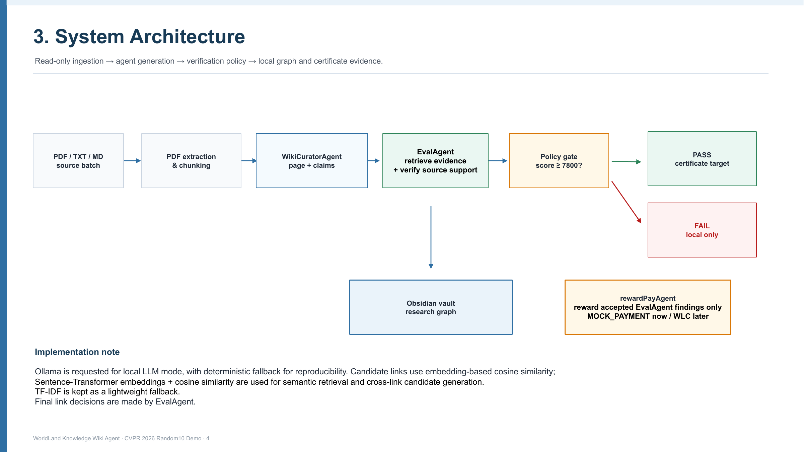

# WorldLand Knowledge Wiki Agent

## 1. Team Name and Members

- Team name: Research Wiki Agent
- Members: Cheon Seungyeon / 천승연

## 2. Primary Project Type

Research/Study Copilot

## 3. Problem Statement and Target User

Researchers and AI students collect papers faster than they can organize, search, verify, and connect them. The target user is a researcher who wants a private, repeatable workflow for turning paper PDFs into structured research notes, source-backed wiki pages, and auditable study logs.

WorldLand Knowledge Wiki Agent helps by running a tool-using pipeline: ingest sources, generate wiki pages, evaluate claims against evidence, record usage logs, and keep failed or hallucinated pages local-only.

## Project Pipeline



Pipeline PDF: [`./slides/pipeline/full_pipeline_slide4.pdf`](slides/pipeline/full_pipeline_slide4.pdf)


## 4. Installation and Execution Instructions

The runnable implementation is in [`./code`](code/).

From the repository root:

```bash
cd code
python -m pip install -r requirements.txt
python demo/demo_pipeline.py --threshold-bps 7800 --llm-provider mock --eval-provider mock --mock-chain --mock-payment --append-usage-log
```

Optional local LLM mode, if Ollama is installed:

```bash
cd code
python demo/demo_pipeline.py --threshold-bps 7800 --llm-provider ollama --eval-provider ollama --mock-chain --mock-payment --append-usage-log
```

Interactive CLI for PDF path input and research-topic input:

```bash
cd code
python demo/source_drop_cli.py --sources-dir ../tmp_sources --output-dir ../tmp_wiki --llm-provider mock --eval-provider mock --mock-chain --mock-payment
```

## 5. Differentiation Statement Versus Big-Tech Assistants/Platforms

This project is not a generic chatbot or cloud-only assistant. It focuses on a local-first research workflow with explicit logs and a blockchain-style publication gate. Generated knowledge pages are evaluated before publication; PASS pages can receive mock certificate records, while FAIL pages remain local-only and are not certified.

The key difference is auditability: the project records source processing, claim evaluation, certificate decisions, and mock payment evidence instead of only returning a conversational answer.

## 6. 7-Day Usage Log Summary

The usage log is stored at [`./usage-log/USAGE_LOG.md`](usage-log/USAGE_LOG.md). Supporting logs are also included in [`./usage-log`](usage-log/):

- `RUN_LOG.jsonl`
- `EVALUATION_LOG.md`
- `CERTIFICATE_LOG.md`
- `PAYMENT_LOG.md`

The logs document real development/demo runs and explicitly record fallback behavior, PASS/FAIL outcomes, mock certificate records, and mock payment records.

## 7. Cost Estimate and Local/Cloud Stack Discussion

Default submission mode uses local/mock execution and requires no paid API call. Ollama can run locally with no per-token cloud charge when installed. Optional OpenAI mode is supported through environment variables, but it is not required for the submitted demo.

Blockchain and payment actions in this repository are mock-only, so the submitted workflow has no real gas cost and sends no real WLC payment.

## 8. Privacy/Security Summary

The default workflow is local-first. `.env` files, private keys, PEM files, and wallet files are ignored by git. The demo does not print private keys and does not claim real WorldLand transactions or real WLC payments.

Real payment or public-chain publication would require explicit human approval and is outside the default safe path.

## 9. Demo Video Link, 5 Minutes or Less

Demo video file: [`./demo-video/demo_video.mp4`](demo-video/demo_video.mp4)

Status: recorded local demo video in MP4 format. Length is about 4 minutes 43 seconds, under the 5-minute requirement.

<video src="demo-video/demo_video.mp4" controls width="720"></video>

## 10. Links to Paper/Report and Slides

- Paper/report: [`./paper/final_report_worldland_knowledge_wiki_agent.docx`](paper/final_report_worldland_knowledge_wiki_agent.docx)
- Slides: [`./slides/final_proj_20261136.pptx`](slides/final_proj_20261136.pptx)
- Pipeline slide PDF: [`./slides/pipeline/full_pipeline_slide4.pdf`](slides/pipeline/full_pipeline_slide4.pdf)

## Final Deliverables

- Code: [`./code`](code/)
- Slides: [`./slides/final_proj_20261136.pptx`](slides/final_proj_20261136.pptx)
- Paper: [`./paper/final_report_worldland_knowledge_wiki_agent.docx`](paper/final_report_worldland_knowledge_wiki_agent.docx)
- Usage Log: [`./usage-log`](usage-log/)
- Demo Video: [`./demo-video/demo_video.mp4`](demo-video/demo_video.mp4)
