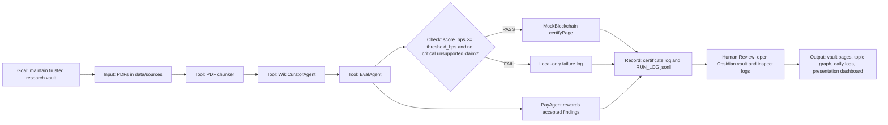

# Agentic Workflow

The project is not a single chatbot. It is a repeatable private research workflow with tools, checks, records, and review gates.

## Loop

```text
Goal -> Input -> Tools -> Check -> Record -> Human Review -> Output
```

## Project Mapping

| Stage | Implementation | Evidence |
|---|---|---|
| Goal | Build a trusted Obsidian research vault from AI papers across major fields | `README.md`, `paper/project_overview.md` |
| Input | User adds PDFs to `data/sources/` | Current 107 PDFs in `data/sources/` |
| Tools | PDF chunker, CuratorAgent, EvalAgent, PayAgent, MockBlockchain, vault builder | `src/`, `demo/build_obsidian_vault.py` |
| Check | Source-groundedness score in basis points; critical unsupported claim gate | `src/agents/evaluator.py`, `usage_log/EVALUATION_LOG.md` |
| Record | Usage log, run JSONL, certificate/payment/evaluation logs, evidence plots | `usage_log/`, `evidence/` |
| Human Review | User opens Obsidian vault, inspects pages, verifies logs before publication/payment | `obsidian_vault/`, `PRESENTATION_DEMO.html` |
| Output | Obsidian vault, daily pages, topic graph, mock tx logs, presentation dashboard | `obsidian_vault/`, `PRESENTATION_DEMO.html` |

## Mermaid Diagram



## Approval Gates

- Read-only PDF ingestion may run without extra approval.
- Local Markdown/log writes are project-local and expected.
- Real WorldLand transaction requires explicit confirmation.
- Real WLC payment requires explicit confirmation every time.
- External LLM use requires configured credentials and cost awareness.
