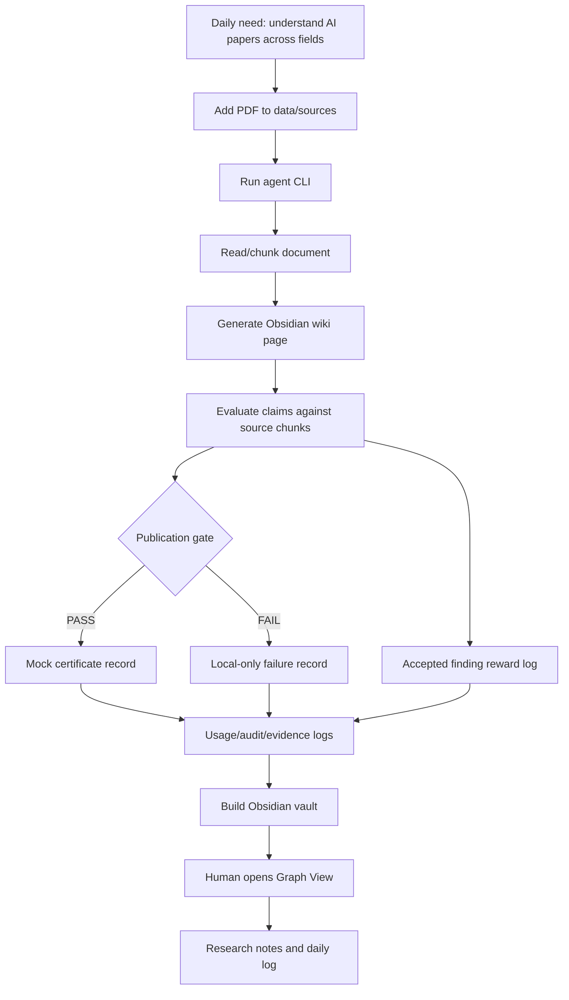

# Workflow Diagram

```mermaid
flowchart TD
    A[Daily need: understand AI papers across fields] --> B[Add PDF to data/sources]
    B --> C[Run agent CLI]
    C --> D[Read/chunk document]
    D --> E[Generate Obsidian wiki page]
    E --> F[Evaluate claims against source chunks]
    F --> G{Publication gate}
    G -->|PASS| H[Mock certificate record]
    G -->|FAIL| I[Local-only failure record]
    F --> J[Accepted finding reward log]
    H --> K[Usage/audit/evidence logs]
    I --> K
    J --> K
    K --> L[Build Obsidian vault]
    L --> M[Human opens Graph View]
    M --> N[Research notes and daily log]
```
